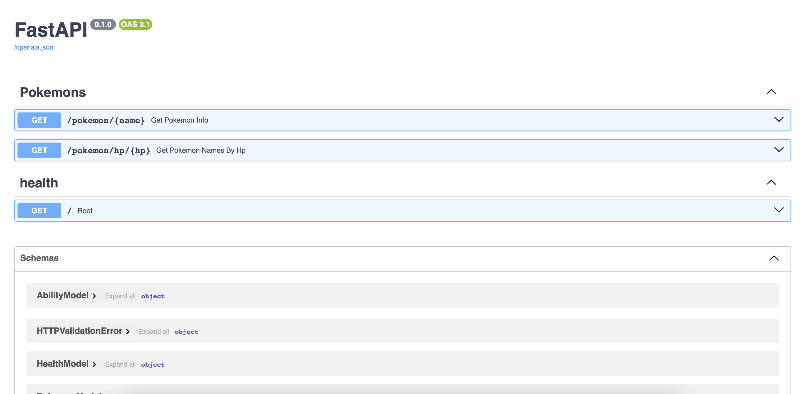

# Pokemon Service (test task)

A simple microservice for building REST APIs with FastAPI and MongoDB.


## Features

+ Python FastAPI backend;
+ MongoDB database;
+ Dockerized.

## Using the application

To use the application, follow the outlined steps:

1. Clone this repository.

2. Start the application using docker:

```console
docker-compose up -d
```


The starter listens on port 8000 on address [http://localhost:8000/](http://localhost:8000/). 


